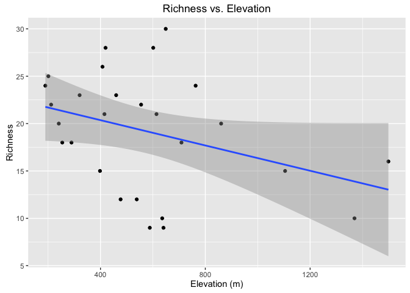
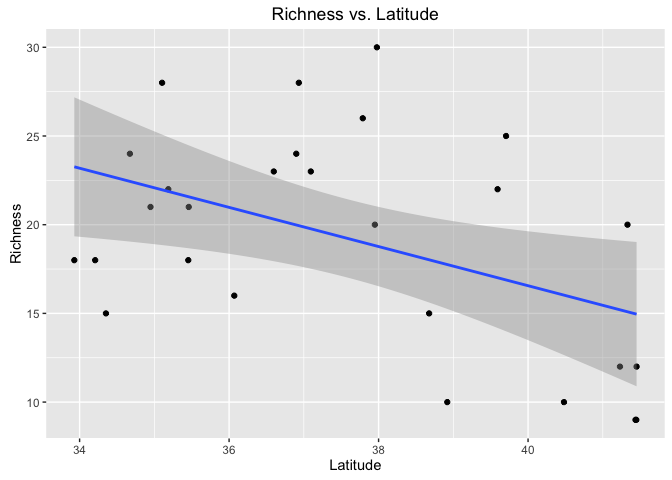

Tree Beta Diversity
================
Patrick McKenzie
February 17, 2017

Introduction
------------

The data consists of 27 protected sites. There are 20 random points in each site and 10 nearest trees sampled around each point.

-   Here are the sites:

<!-- -->

    ##  [1] "TNPickett"         "TNFranklin"        "GAFloyd"          
    ##  [4] "KYLaurel"          "SCPickens"         "SCGreenville"     
    ##  [7] "ALCherokee"        "ALJackson"         "MDWashington"     
    ## [10] "MDAllegany"        "PABlair"           "PA2Clinton"       
    ## [13] "PA1Clinton"        "PA3Moosic"         "PA2Moosic"        
    ## [16] "PA1Moosic"         "AlStClair"         "NCRumblingBald1"  
    ## [19] "NCRumblingBald3"   "NCLittleYellowMtn" "WVMtPorteCrayon"  
    ## [22] "WVPikeKnob"        "VAFortunesCove"    "VABath1"          
    ## [25] "VABath2"           "VAWise"            "VARussell"

-   Here is a sample of how the **tree** data is arranged.

<!-- -->

    ##        Site Point              Species Latitude Longitude
    ## 1 TNPickett    15     Pinus_virginiana 36.59055 -84.86395
    ## 2 TNPickett    15     Pinus_virginiana 36.59055 -84.86395
    ## 3 TNPickett    15     Pinus_virginiana 36.59055 -84.86395
    ## 4 TNPickett    15 Diospyros_virginiana 36.59055 -84.86395
    ## 5 TNPickett    15      Nyssa_sylvatica 36.59055 -84.86395
    ## 6 TNPickett    15          Acer_rubrum 36.59055 -84.86395

-   Here is a sample of how the **site** data is arranged.

<!-- -->

    ##          Site Latitude Elevation TempMax TempMin
    ## 381 TNPickett 36.60321       364    29.6    -5.1
    ## 382 TNPickett 36.60223       463    28.9    -5.3
    ## 383 TNPickett 36.60084       472    29.6    -5.1
    ## 384 TNPickett  36.6058       431    29.6    -5.1
    ## 385 TNPickett 36.60537       464    29.1    -5.2
    ## 386 TNPickett 36.59153       485    29.3    -5.1

Methods
-------

-   First, a richness value was determined for each site.
    -   For the sake of simplicity, richness will be measured as the number of tree species present in each site. Various other methods for assessing biodiversity exist that could account for species rarity, etc.
-   The code for this is simple:

``` r
site.names <- unique(treedf$Site) #Makes a vector of site names from our full "sitedf" data frame
richnesses <- character(0) #Makes an empty object to store our richness values
for (i in 1:length(site.names)) {
  trees.in.site <- treedf[(treedf$Site == site.names[i]),"Species"] #collects names of all 200 trees in the site
  species.in.site <- unique(trees.in.site) #collects the species included in the 200-tree subset
  site.richness <- length(species.in.site) #saves the number of species in the site
  richnesses <- c(richnesses,site.richness) #combines the number of species in each site together in a vector
}
analysis_df <- as.data.frame(cbind(as.character(site.names),as.numeric(richnesses)),stringsAsFactors = F) #combines site names with their richnesses into a data frame
colnames(analysis_df) <- c("Site","Richness")
class(analysis_df)
```

    ## [1] "data.frame"

``` r
analysis_df
```

    ##                 Site Richness
    ## 1          TNPickett       23
    ## 2         TNFranklin       28
    ## 3            GAFloyd       18
    ## 4           KYLaurel       23
    ## 5          SCPickens       21
    ## 6       SCGreenville       22
    ## 7         ALCherokee       15
    ## 8          ALJackson       24
    ## 9       MDWashington       25
    ## 10        MDAllegany       22
    ## 11           PABlair       10
    ## 12        PA2Clinton       20
    ## 13        PA1Clinton       12
    ## 14         PA3Moosic        9
    ## 15         PA2Moosic        9
    ## 16         PA1Moosic       12
    ## 17         AlStClair       18
    ## 18   NCRumblingBald1       18
    ## 19   NCRumblingBald3       21
    ## 20 NCLittleYellowMtn       16
    ## 21   WVMtPorteCrayon       10
    ## 22        WVPikeKnob       15
    ## 23    VAFortunesCove       26
    ## 24           VABath1       30
    ## 25           VABath2       20
    ## 26            VAWise       24
    ## 27         VARussell       28

-   I'm interested in seeing the relationship between latitude and richness in these sits, so I also need a "Latitude" column. I'm going to take the average latitude for the points in each site.

``` r
for (i in 1:length(site.names)) {
latitudes <- sitedf[(sitedf$Site == site.names[i]),"Latitude"]
analysis_df$Latitude[i] <- mean(as.numeric(latitudes))
}
for (i in 1:length(site.names)) {
elevations <- sitedf[(sitedf$Site == site.names[i]),"Elevation"]
analysis_df$Elevation[i] <- mean(as.numeric(elevations))
}
head(analysis_df)
```

    ##           Site Richness Latitude Elevation
    ## 1    TNPickett       23 36.59800    459.80
    ## 2   TNFranklin       28 35.10354    419.30
    ## 3      GAFloyd       18 34.20810    254.20
    ## 4     KYLaurel       23 37.09342    320.35
    ## 5    SCPickens       21 34.94850    415.10
    ## 6 SCGreenville       22 35.18637    555.00

-   Now we can plot it!

``` r
ggplot(analysis_df, aes(Elevation,as.numeric(Richness))) + 
  geom_point() + 
  geom_smooth(method = "lm", formula = y ~ x) +
  ggtitle("Richness vs. Elevation") +
  xlab("Elevation (m)") + 
  ylab("Richness") +
  theme(text=element_text(family="Arial"))
```



``` r
ggplot(analysis_df, aes(Latitude,as.numeric(Richness))) + 
  geom_point() + 
  geom_smooth(method = "lm", formula = y ~ x) +
  ggtitle("Richness vs. Latitude") +
  xlab("Latitude") + 
  ylab("Richness") +
theme(text=element_text(family="Arial"))
```



Discussion
----------

As shown in the above graphs, we expect a negative relationship between **elevation** and tree species richness and between **latitude** and tree species richness.

-   At high-elevation and high-latitude sites, we expect fewer tree species.

This relationship might change, though, if we were instead interested in rare species.

-   Future studies could use a different metric for biodiversity or could instead investigate diversity partitioning between sites.
